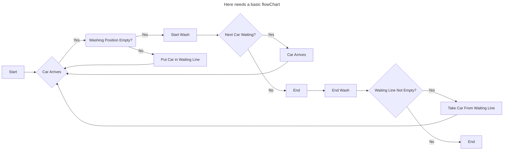

# Learn by example

In this section we will focus on a standard use-case of using Drops in the context of discrete-event simulations. The following example will
also play another role in the advanced section where we will describe how to combine Drops with Flask to make a live web-application
that shows the current state of the simulation in a UI.

## Car Washing Line

### Problem statement and simulation model

No discrete-event simulation tutorial would be considered comprehensive without the classic example of a car washing line. Here's the
scenario:

Imagine a scenario where cars arrive at a car wash in an unpredictable pattern from a finite source. At the facility, there's a single
washing line that takes approximately $d \in \mathbb{N}$ minutes to complete a cycle for each car.

Once a car finishes its wash, the next car in line is permitted to enter the washing process.

A naive approach to model this in a flow-chart could look like this:



### Implementation of Drops-Components

In Drops we call everything that can be registered a **Component**. This is a pure function, a class-instance, a module, a
generator-function or a closure.

#### Entities and value-objects

During our implementation we will be as explicit as possible and use type annotations, aka. Annotated type-hints from the `typing.py`
module.
The first and last entity we are going to model, is the _car_.

```python title="car.py"
{!../docs_src/car_wash/001.py!}
```

As we can see, our car only has two immutable attributes, namely an Id that will serve as a plain counter and a percentage value _dirt_ that
tells us how dirty the car is.

#### Sources

Now we need something that can send a car in a specific time period to our washing line. We will call this thing a **source**. 
In our case, we will model our source as a finite source sending cars every 5 minutes to our washing line.

```python title="source.py"
{!../docs_src/car_wash/002.py!}
```


Most developers would have started using a class-based approach to model our source. But since Drops is capable of registering  we decide on using
a one to model our car-source. This will make our code more concise and remove some unnecessary boilerplate as well.

####  